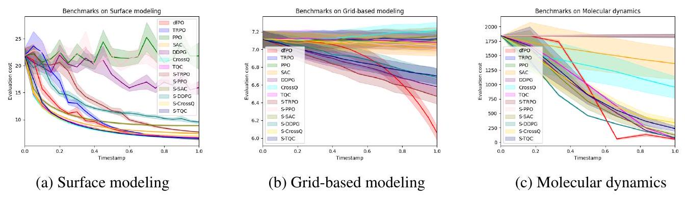

# A Differential and Pointwise Control Approach to Reinforcement Learning

### Authors / Affiliations

**Minh Nguyen<sup>1</sup>, Chandrajit Bajaj<sup>1</sup>**

<sup>1</sup>Department of Computer Science & Oden Institute, The University of Texas at Austin

### Venue line

**NeurIPS 2025 Poster** &nbsp; | &nbsp; **arXiv 2024**

---

### Links

- arXiv (2024): [arXiv:2404.15617](https://arxiv.org/abs/2404.15617)
- Code: [mpnguyen2/dfPO](https://github.com/mpnguyen2/dfPO)

---

### TL;DR

Differential RL reframes reinforcement learning as a continuous-time control problem with a Hamiltonian dual structure. The resulting algorithm, Differential Policy Optimization (dfPO), updates policies pointwise along trajectories, improving sample efficiency and physical consistency in scientific computing tasks.

---

### Why this matters

Many scientific RL problems are expensive to simulate, have sparse feedback, and require physically plausible rollouts. Standard RL methods often need large sample budgets and can drift from dynamics constraints. Differential RL targets this gap by using a physics-informed differential formulation while still operating in black-box environments.

---

### Core idea

Instead of optimizing only cumulative rewards over discrete steps, Differential RL maps RL to a differential dual system derived from Pontryagin-style optimal control. This yields a reduced Hamiltonian representation and a learned dynamics operator that is refined stage-wise.

dfPO then trains local trajectory operators point-by-point, so updates stay aligned with trajectory structure rather than relying only on global value approximation.



**Figure 1.** Evaluation costs over training episodes on three scientific-computing tasks. The differential/pointwise approach consistently reaches lower final costs under limited data budgets.

---

### Theory highlights

- Pointwise convergence guarantees for stage-wise operator learning.
- Regret bound of $\mathcal{O}(K^{5/6})$ in the restricted hypothesis setting.
- Sample complexity analysis for both general neural approximators and structured subclasses.

---

### Experimental results

The paper evaluates dfPO on:

- Surface modeling with geometry-aware objective functionals.
- Grid-based modeling with coarse-control/fine-evaluation mismatch.
- Molecular dynamics (octa-alanine) with energy-based objectives.

Across these tasks, dfPO reports lower evaluation costs than standard RL baselines and reward-shaped variants in low-data settings, with especially strong gains in physics-constrained regimes.

---

### Poster note

This work was presented as a **NeurIPS 2025 poster**, with an earlier **arXiv 2024** version.

---

### Citation

```bibtex
@article{nguyen2024differentialrl,
  title   = {A Differential and Pointwise Control Approach to Reinforcement Learning},
  author  = {Nguyen, Minh and Bajaj, Chandrajit},
  journal = {arXiv preprint},
  year    = {2024},
  note    = {NeurIPS 2025 poster}
}
```
