# GRL-SNAM: Geometric Reinforcement Learning for Simultaneous Navigation and Mapping

### ICLR 2026

**Aditya Sai Ellendula, Yi Wang, Minh Nguyen, Chandrajit Bajaj**

Department of Computer Science & Oden Institute, University of Texas at Austin

[[Paper]](https://arxiv.org/abs/2601.00116) &nbsp; [[Code]](https://github.com/CVC-Lab/GRL-SNAM)

---

## TL;DR

> **Navigate unknown environments by learning energy landscapes, not reward functions.**
>
> GRL-SNAM casts simultaneous navigation and mapping as learning a _scenario-to-Hamiltonian_ map. Instead of training a black-box policy via Bellman backups, we learn a structured energy function whose forward flow generates safe, efficient trajectories enabling a deformable robot to squeeze through cluttered passages while mapping only **~10%** of the workspace.

---

## Motivation: Why Standard RL Fails at Navigation

Standard deep RL controllers learn a frozen behavior that breaks when local obstacle geometry changes. Three structural limitations are particularly acute: (1) **sample efficiency** -- continuous control demands massive data collection, (2) **generalization** -- black-box policies memorize training environments, and (3) **temporal scale separation** -- navigation couples fast obstacle avoidance with slow global planning.

GRL-SNAM performs **online Hamiltonian correction** using only short-horizon feedback (clearance, goal distance, speed), adjusting its motion field to avoid obstacles and maintain progress.

|     |                      Baseline (Frozen RL)                       |                                                                 |                                                                 |
| :-: | :-------------------------------------------------------------: | :-------------------------------------------------------------: | :-------------------------------------------------------------: |
|     | 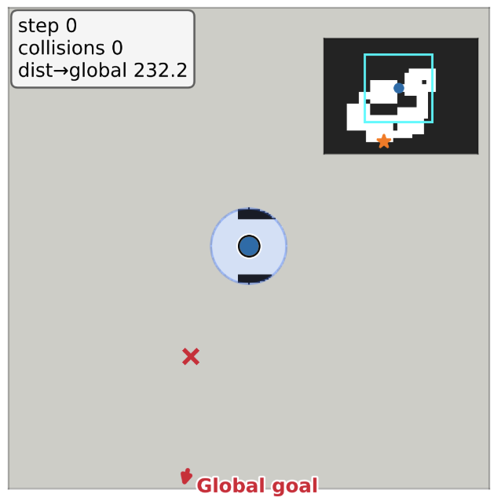 | 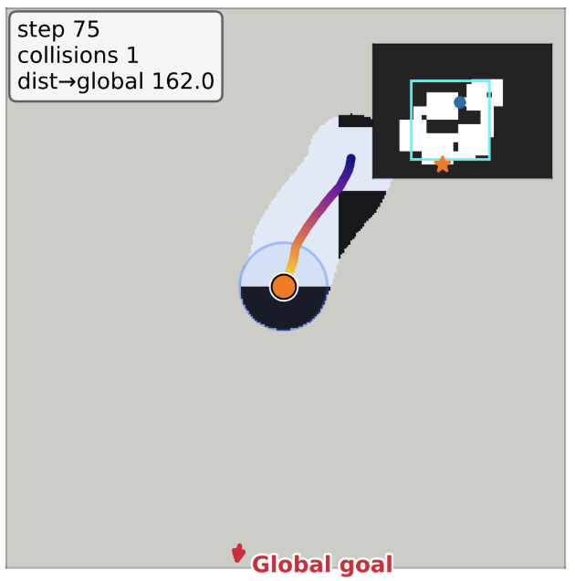 | 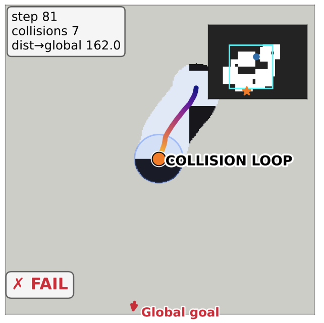 |
|     |                       **Ours (GRL-SNAM)**                       |                                                                 |                                                                 |
|     |     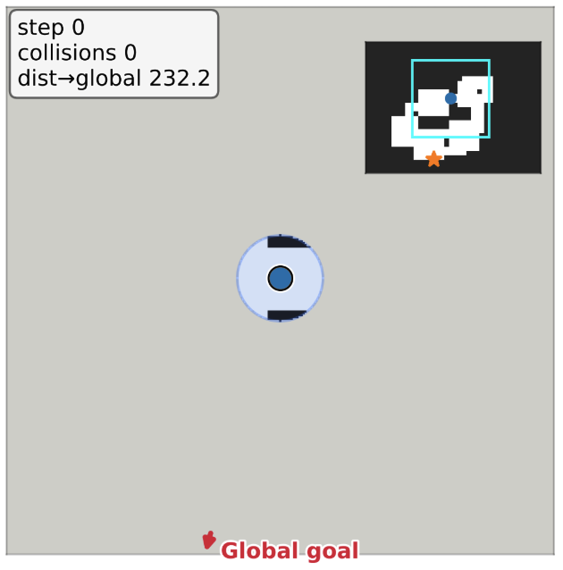     |     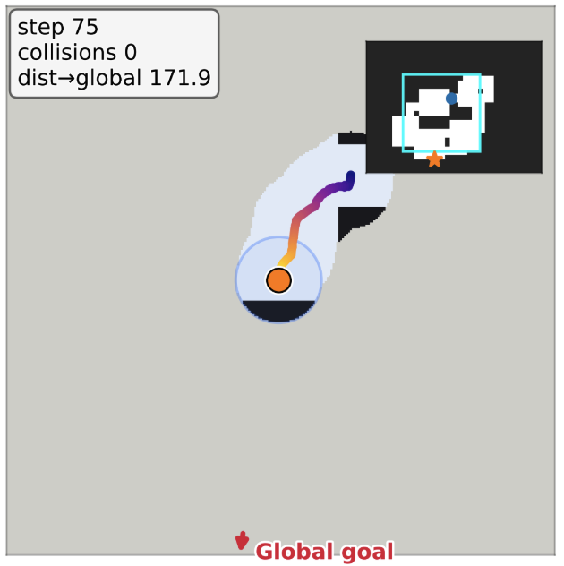     |     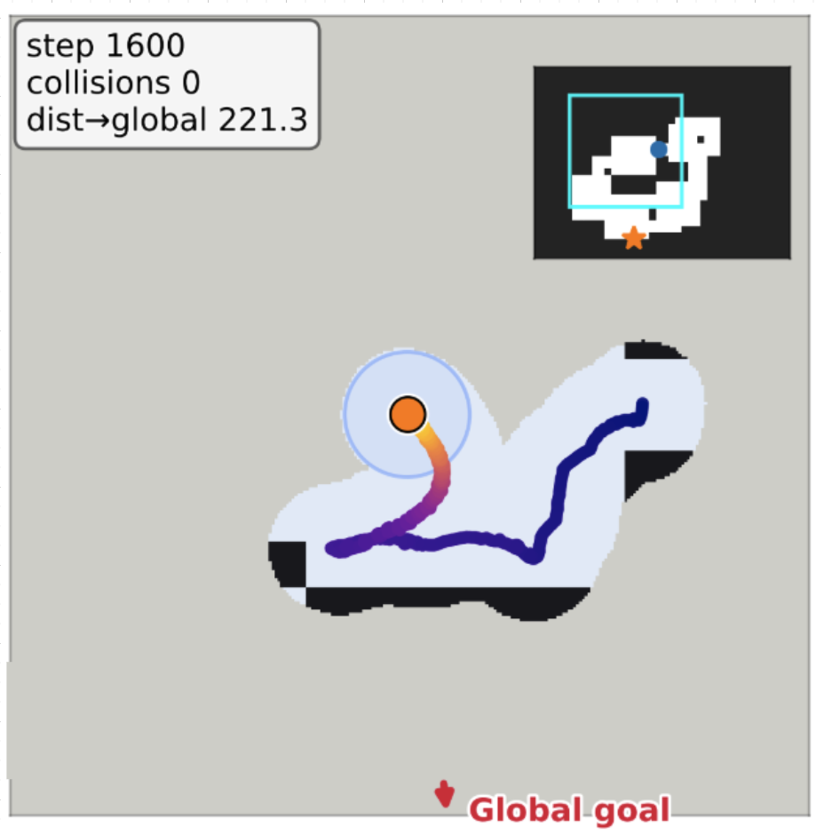     |

**Figure 1 -- Fixed policy vs. online adaptation.** _Top row:_ a fixed RL controller enters a collision loop as local geometry changes. _Bottom row:_ GRL-SNAM performs online correction by adjusting its Hamiltonian-shaped motion field using only short-horizon feedback, reaching the global goal.

---

## Key Results at a Glance

| Metric               | Value                   |
| :------------------- | :---------------------- |
| **Success Rate**     | 98.7% (nominal)         |
| **SPL**              | 0.95                    |
| **Workspace Mapped** | ~10%                    |
| **Training Steps**   | 500k (vs. 3--8M for RL) |

> **Core finding:** Under identical sensing and interfaces, GRL-SNAM achieves CBF-level path efficiency while sensing only ~10% of the workspace. Deep RL baselines (PPO/TRPO/SAC) plateau below 30% success with 3--8M environment steps; GRL-SNAM reaches **87.5% success with 500k gradient steps** on the dungeon benchmark.

---

## Contributions

1. **Navigation via Hamiltonian Dynamics.** We cast SNAM as learning a scenario-to-Hamiltonian map. The constrained optimal control problem per stage is reduced via PMP + barrier relaxation to a mechanical Hamiltonian whose forward flow map _is_ the policy -- no backward HJB solve needed.

2. **Multi-Scale Energy Coordination.** Three sub-modular policies (sensing, frame, shape) evolve at natural timescales under shared dual weights, achieving temporal scale separation _without_ hand-designed hierarchies.

3. **Offline--Online Adaptation.** Offline: learn reference Hamiltonians from trajectory data. Online: adapt energy weights via secant Jacobian estimation on short-horizon observables -- stable, low-variance, structure-preserving.

4. **Deformable Robot Validation.** A hyperelastic ring robot that must squeeze through cluttered narrow passages -- a task where rigid planners _provably fail_. GRL-SNAM outperforms all baselines on success, safety, and efficiency.

---

## Method

### The Core Idea: Learn the Energy _and_ the Dynamics, Not the Action

GRL-SNAM replaces reward-maximizing policies with a **learnable Hamiltonian system** -- both the energy landscape _and_ the dynamics it induces. A small neural network (the "navigator" $g_\xi$) takes local environment context and outputs nonnegative energy weights that shape the potential, a dissipation coefficient that governs how quickly the system damps, and a port correction term that injects non-conservative forces when energy reshaping alone is insufficient. Together, these define a complete generalized Hamiltonian dynamics whose forward _flow map_ directly generates the robot's trajectory.

**The Reduced Hamiltonian:**

$$
H(\mathbf{q}, \mathbf{p}; \mathcal{E}) = \tfrac{1}{2}\mathbf{p}^\top M^{-1}\mathbf{p} \;+\; \underbrace{\beta \cdot E_{\text{goal}}}_{\text{Goal Attraction}} \;+\; \underbrace{\lambda \cdot E_{\text{deform}}}_{\text{Shape Cost}} \;+\; \underbrace{\textstyle\sum_i \alpha_i \cdot b(d_i)}_{\text{Collision Barriers}} \;+\; \underbrace{E_{\text{sensor}}}_{\text{Sensing Cost}}
$$

The navigator $g_\xi$ maps environment context to dual weights $(\beta, \lambda, \{\alpha_i\})$ that reweight these fixed energy terms plus a dissipation $\mu$ and port correction $u_f$.

### Modular Score-Field Architecture

Given the current state $z_\theta$, goal $x_g$, and locally sensed environment context, the navigator $g_\xi$ tokenizes active constraints and outputs meta-parameters: energy weights, frame dissipation, and an optional port input. These modulate a fixed library of interpretable energy terms to form module-specific Hamiltonians. A symplectic integrator rolls out the dynamics. _Offline training_ learns the context-to-parameters mapping; _online adaptation_ updates parameters using a smoothed secant Jacobian estimate.

### Three Sub-Modular Policies

| Policy             | Manifold | Timescale      | Dynamics                        | Role                                 |
| :----------------- | :------- | :------------- | :------------------------------ | :----------------------------------- |
| **Sensor** $\pi_y$ | $Q_y$    | Slow ($T_y$)   | Purely symplectic               | Acquire environment representation   |
| **Frame** $\pi_f$  | $Q_f$    | Medium ($T_f$) | Symplectic + dissipation + port | Local motion toward stage goals      |
| **Shape** $\pi_o$  | $Q_o$    | Fast ($T_o$)   | Purely symplectic               | Morphology control (e.g., squeezing) |

The policies are coupled through **shared dual weights** from a permutation-invariant set encoder and not a hand-designed hierarchy.

### Online Adaptation: Secant-Based Energy Reshaping

During online navigation, GRL-SNAM tracks an observable vector:

$$
\mathbf{y}_t = [-\text{clearance}_t, \;\text{dist}_t, \;-\text{speed}_t]^\top
$$

Parameter corrections are computed via a smoothed secant Jacobian estimate and Tikhonov-regularized least squares. Any residual unresolvable by weight adjustment is handled by a port correction term $u_f$.

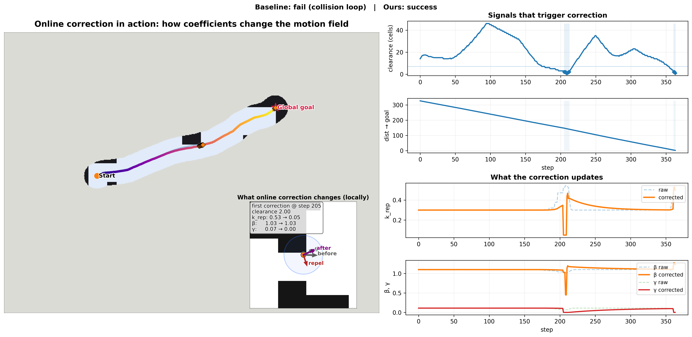

**Figure 3 -- Online correction mechanism.** _Left:_ the frozen baseline enters a collision loop, while GRL-SNAM reaches the goal by applying local corrections. _Right:_ the observable vector $y_t$ triggers adaptation; dual weights and dissipation are updated stage-locally to restore safety while maintaining goal progress.

---

## Qualitative Results

### Episode Rollout Through Cluttered Layout

|                           t=1                            |                           t=295                            |                           t=721                            |
| :------------------------------------------------------: | :--------------------------------------------------------: | :--------------------------------------------------------: |
| 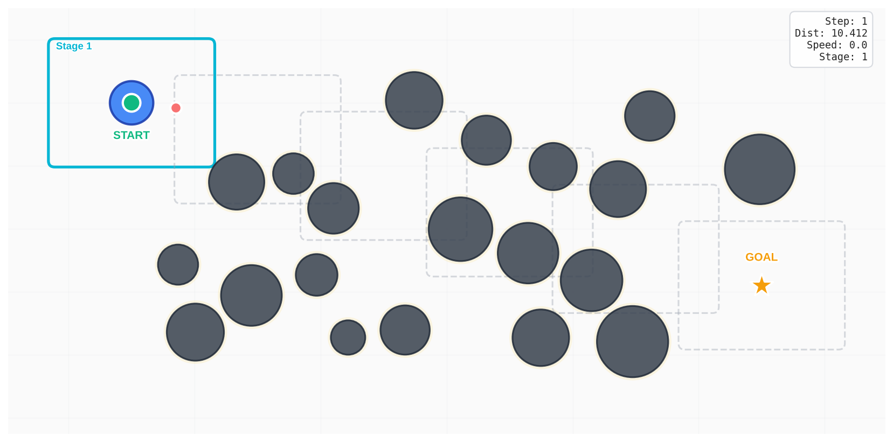 | 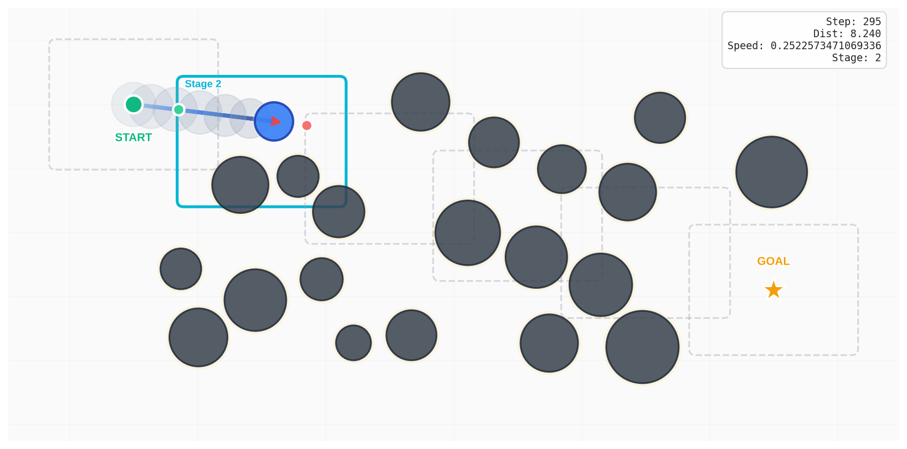 | 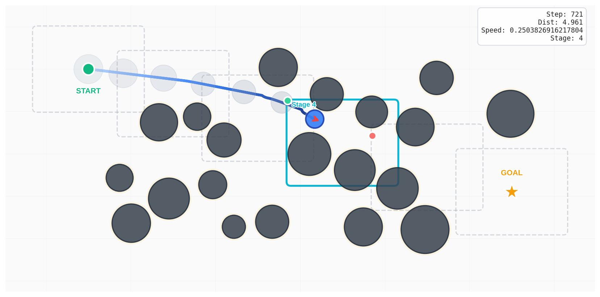 |
|                    **Initialization**                    |                    **Corridor commit**                     |                    **Squeeze-through**                     |

|                           t=889                            |                           t=1177                            |                           t=1354                            |
| :--------------------------------------------------------: | :---------------------------------------------------------: | :---------------------------------------------------------: |
| 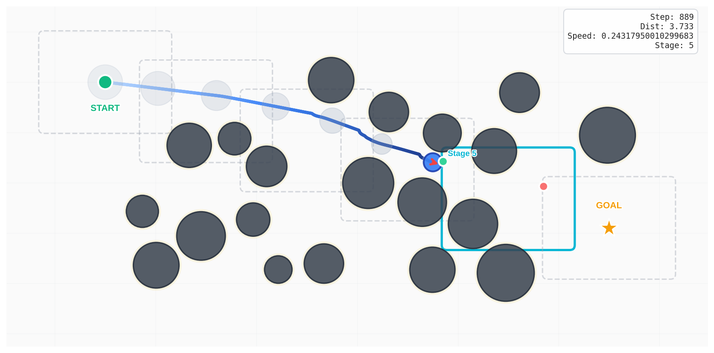 | 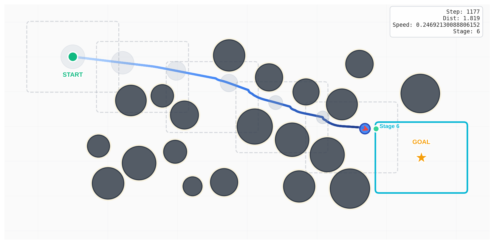 | 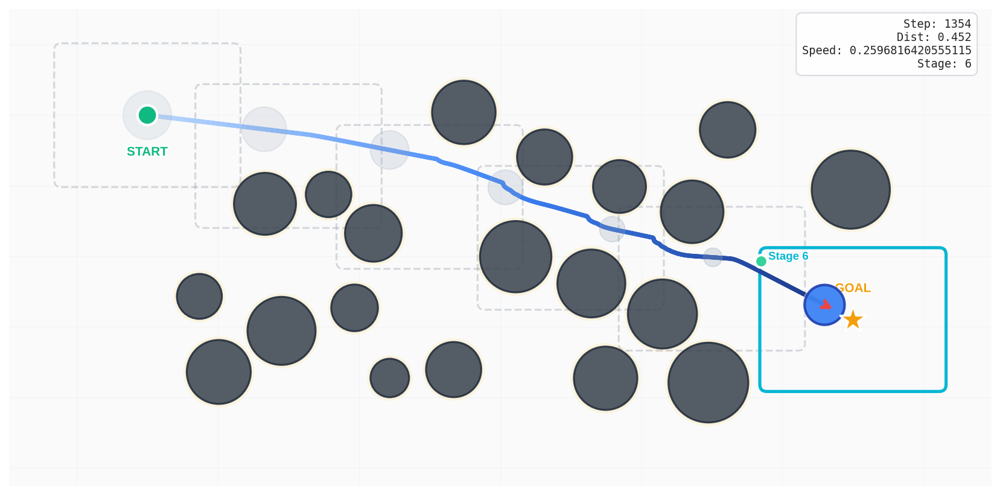 |
|                        **Recovery**                        |                     **Final approach**                      |                      **Goal reached**                       |

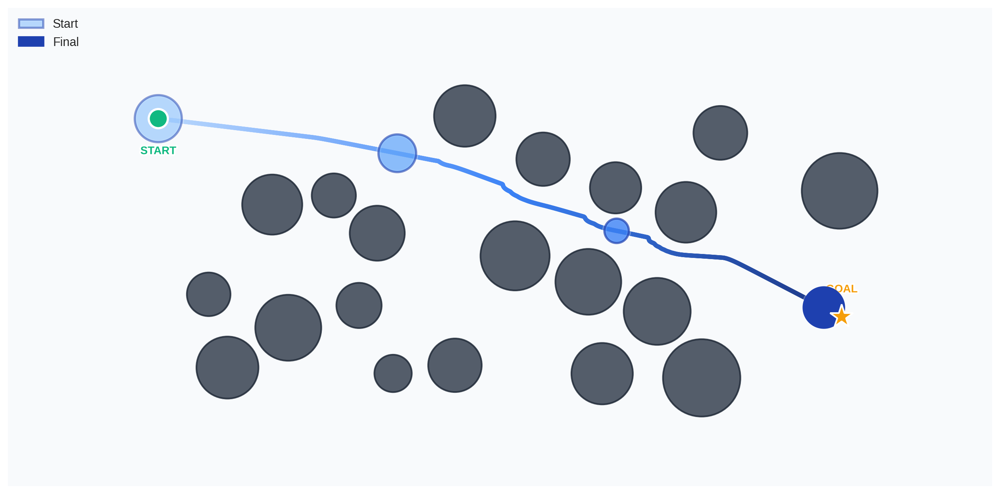

**Figure 4 -- GRL-SNAM rollout on a cluttered layout.** The agent progresses through initialization, corridor commitment, bottleneck entry, squeeze-through of a narrow passage, recovery/re-centering, and successful goal arrival. The full trajectory overlay shows a smooth, efficient path.

### Dungeon Navigation Comparison

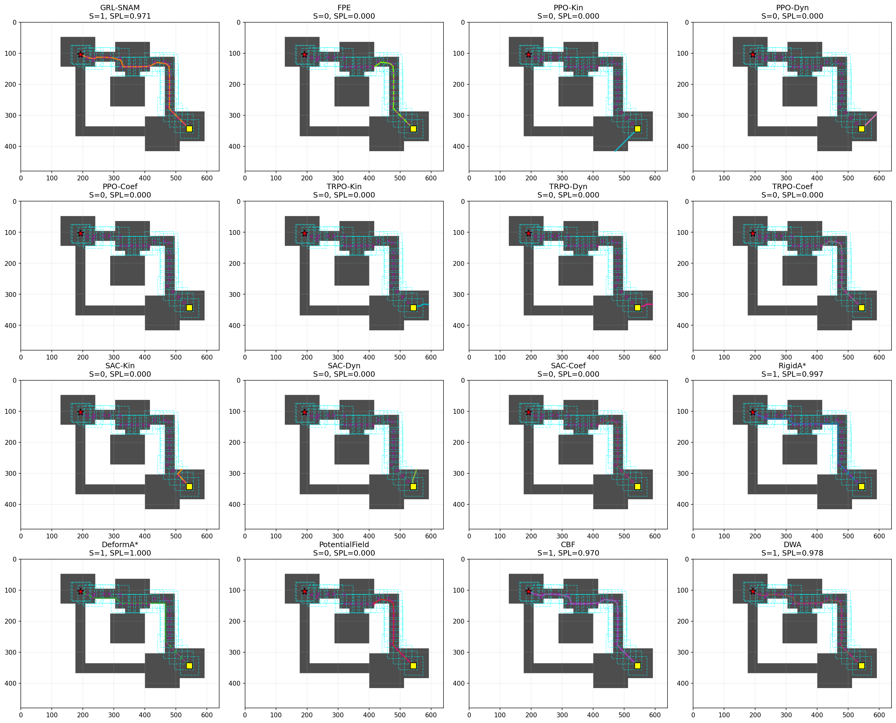

**Figure 5 -- Representative dungeon rollouts under stagewise local sensing.** Each panel shows the same layout with goal (red x), start (yellow square), executed trajectory (colored by time), and visited sensing windows (cyan). GRL-SNAM reaches the goal with near-planner efficiency; RL baselines and the greedy potential-field baseline fail.

---

## Quantitative Results

### Navigation Quality vs. Mapping Effort (Hyperelastic Ring)

All stagewise methods use the **same sensing window and stage manager**. RL variants share the same interface and short-rollout distribution -- only the learning rule differs.

| Method              |   SPL    |  Detour  | Min Clear (m) | Mapping (%) |
| :------------------ | :------: | :------: | :-----------: | :---------: |
| Potential Field     |   0.77   |   1.42   |     0.18      |    10.3     |
| CBF                 | **0.96** | **1.04** |   **0.32**    |    11.2     |
| **GRL-SNAM (Ours)** | **0.95** |   1.09   |     0.26      |  **10.7**   |
| PPO-Kin             |   0.14   |   1.87   |     -0.36     |    15.4     |
| PPO-Dyn             |   0.00   |   2.31   |     0.77      |    18.1     |
| TRPO-Coef           |   0.57   |   1.44   |     0.004     |    15.3     |
| SAC-Coef            |   0.57   |   1.53   |     0.004     |    14.6     |

> **Takeaway:** GRL-SNAM matches CBF-level path efficiency (SPL 0.95 vs 0.96) at PF-level sensing cost (~10.7%), with strictly positive clearance. Deep RL consumes 14--18% mapping yet remains far behind.

### Dungeon Navigation: Learning Strategy > Optimizer Choice

| Method              | Success (%) | State Error (m) | Goal Dist (m) | Training Steps |
| :------------------ | :---------: | :-------------: | :-----------: | :------------- |
| PPO (full-episode)  |     7.2     |       --        |     14.1      | 5M env         |
| TRPO (full-episode) |     3.8     |       --        |     23.7      | 6.5M env       |
| SAC (full-episode)  |     1.5     |       --        |     20.2      | 8M env         |
| PPO (stagewise)     |    26.1     |       1.8       |      1.2      | ~3.2M env      |
| TRPO (stagewise)    |    21.7     |       2.1       |      1.5      | ~3.8M env      |
| SAC (stagewise)     |    18.4     |       2.4       |      1.9      | ~4.1M env      |
| **GRL-SNAM (Ours)** |  **87.5**   |     **0.3**     |    **0.1**    | **500k grad**  |

With dynamics, sensing, and encoder fixed, swapping PPO/TRPO/SAC changes results modestly but does not close the gap. The advantage is driven by **Hamiltonian-structured supervision**, not algorithm choice.

### Aggregate Performance Dashboards

|                                Test-ID                                |                             Test-OOD                             |
| :-------------------------------------------------------------------: | :--------------------------------------------------------------: |
| 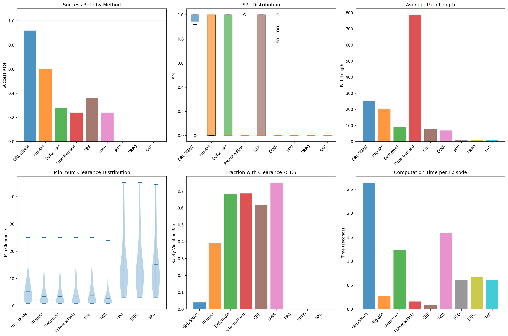 | 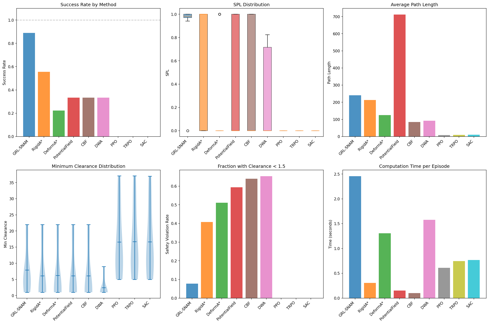 |

**Figure 7 -- Test-ID / Test-OOD dashboards.** _Top row:_ success rate, SPL distribution, path length. _Bottom row:_ min clearance distribution, grazing rate, compute time. GRL-SNAM achieves high success with SPL concentrated near 1.0 while maintaining strictly positive clearance at moderate compute.

---

## Analysis: What Does GRL-SNAM Learn?

### Temporal Coefficient Adaptation

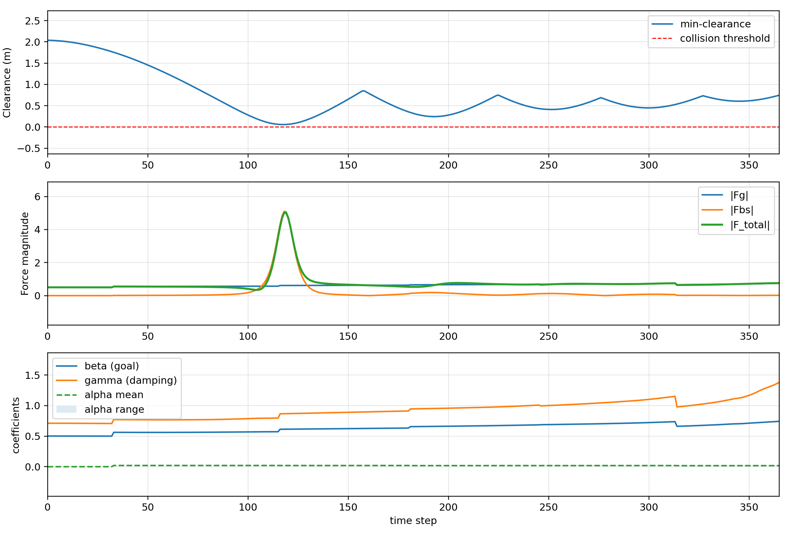

**Figure 9 -- Temporal analysis of Hamiltonian adaptation.** _Top:_ minimum clearance drops near bottlenecks and recovers after passage. _Middle:_ force magnitudes rebalance accordingly. _Bottom:_ coefficients vary smoothly, confirming adaptation occurs through Hamiltonian parametrization, not ad hoc action scaling.

### Learned Barrier Profiles Match Physics

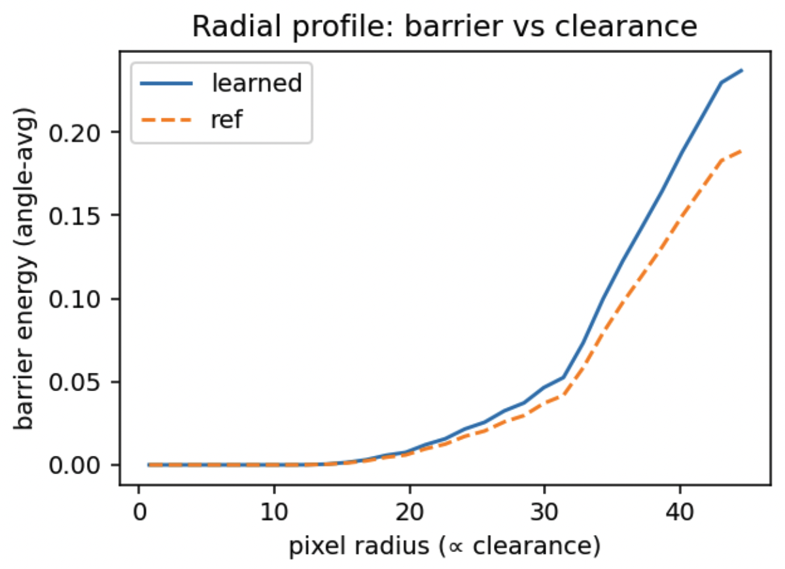

**Figure 10 -- Radial barrier energy vs. clearance.** The angle-averaged learned barrier (solid) closely tracks the analytic reference (dashed) -- near-zero at large clearance, sharp rise near contact -- while slightly softening at intermediate distances and steepening near contact, capturing additional deformation/friction costs.

---

## Ablations

### Effect of Loss Components

| Variant                       | Collisions | Min Clear | Progress/SPL | Behavior                |
| :---------------------------- | :--------: | :-------: | :----------: | :---------------------- |
| No friction, no multi-start   |    High    |    < 0    |     Poor     | Penetrates obstacles    |
| No friction, with multi-start |    Low     |   High    |     Low      | Very slow, conservative |
| With friction, no multi-start |    None    |   High    |   **High**   | Smooth, stable, fast    |
| **Both (full model)**         |    None    |   Good    |   **High**   | Stable; tighter margins |

Friction loss prevents oscillatory barrier violations; multi-start loss adds near-contact robustness. Combined gives the best overall trade-off.

### Robustness to Sensing and Dynamics Perturbations

| Perturbation Level       | Success (%) | SPL  | Min Clear (m) | Collisions |
| :----------------------- | :---------: | :--: | :-----------: | :--------: |
| Nominal (0.0, 1.0)       |  **98.7**   | 0.82 |     0.36      |    0.3     |
| Mild Noise (0.05, 0.9)   |    91.3     | 0.79 |     0.33      |    0.7     |
| Severe Noise (0.10, 0.7) |    87.1     | 0.72 |     0.29      |    1.1     |

Even under severe noise, GRL-SNAM maintains **87% success** -- still outperforming RL baselines at _nominal_ conditions. The energy landscape reshapes adaptively rather than overfitting to a single model.

---

## The Hyperelastic Ring Robot

Our test platform is a planar hyperelastic ring with a periodic cubic B-spline boundary. It is the **simplest soft body that provably requires shape change** to solve our benchmarks -- a rigid disc of any fixed radius cannot pass through the same bottlenecks.

The shape policy $\pi_o$ controls a single deformation DOF (uniform scale _s_), with a clearance-dependent target:

$$
s_{\text{target}} = s_0 + (1 - s_0)\tanh(\delta \cdot \max(d_{\min}, 0))
$$

This encourages compression in tight passages while keeping the ring expanded in free space.

---

## How GRL-SNAM Differs from Standard RL

|                       | Standard Deep RL                   | GRL-SNAM                              |
| :-------------------- | :--------------------------------- | :------------------------------------ |
| **What is learned**   | Policy $\pi(a\|s)$ or value $V(s)$ | Hamiltonian $H(q,p;\varepsilon)$      |
| **Update mechanism**  | Bellman backups / policy gradient  | Forward Hamiltonian flow              |
| **Safety**            | External CBF projection layer      | Internal barrier potentials in energy |
| **Adaptation**        | Fine-tune entire policy            | Reweight energy terms online          |
| **Structure**         | Flat Euclidean, unstructured       | Symplectic, physics-preserving        |
| **Interpretability**  | Black box                          | Decomposable force fields             |
| **Sample efficiency** | 3--8M env steps                    | 500k gradient steps                   |

---

## Energy Landscape Exploration

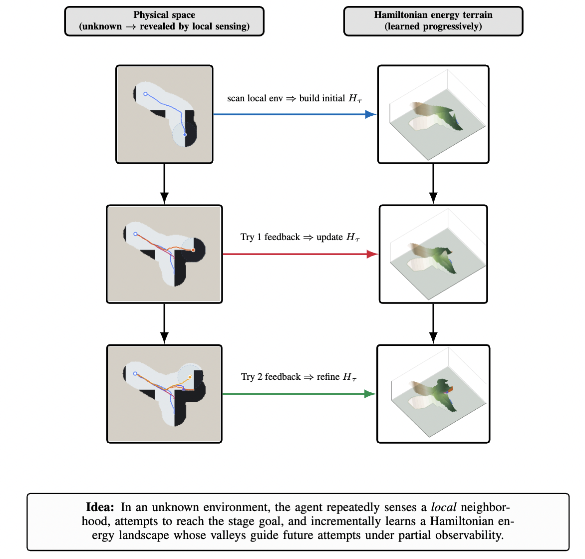

**Figure 12 -- Energy landscape visualization.** GRL-SNAM explores the geometry and topology of the Hamiltonian landscape. Each environment context maps to a shaped potential whose gradients induce goal-seeking, obstacle-avoiding, deformation-aware dynamics.

|                      Physical Trial 1                       |                      Physical Trial 2                       |                      Physical Trial 3                       |
| :---------------------------------------------------------: | :---------------------------------------------------------: | :---------------------------------------------------------: |
| 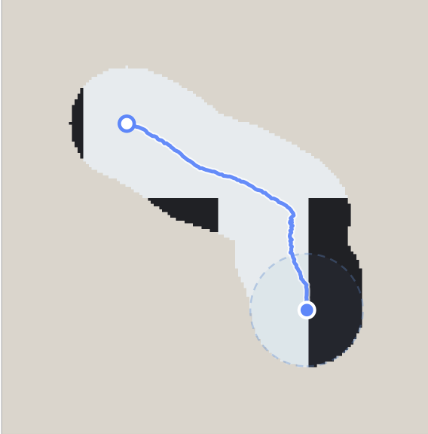 | 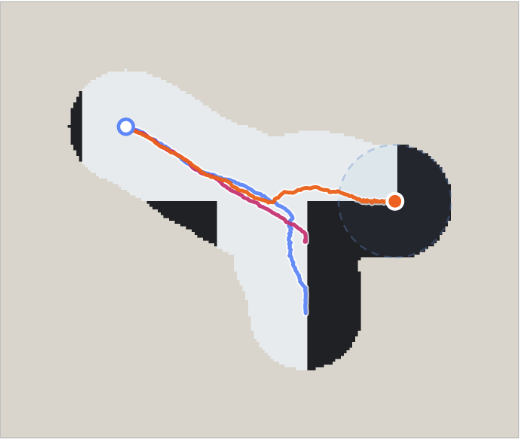 | 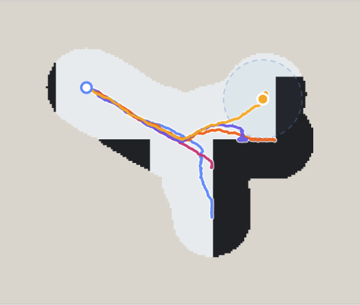 |

---

## Citation

```bibtex
@inproceedings{ellendula2026grlsnam,
      title={GRL-SNAM: Geometric Reinforcement Learning with Path Differential
             Hamiltonians for Simultaneous Navigation and Mapping
             in Unknown Environments},
      author={Aditya Sai Ellendula and Yi Wang and Minh Nguyen
              and Chandrajit Bajaj},
      booktitle={International Conference on Learning Representations (ICLR)},
      year={2026},
      url={https://arxiv.org/abs/2601.00116},
}
```

---

## Acknowledgements

_This research was supported in part from the Peter O'Donnell Foundation, the Jim Holland-Backcountry Foundation and in part from a grant from the Army Research Office accomplished under Cooperative Agreement Number W911NF-19-2-0333._

---

## People

- [Chandrajit Bajaj](https://www.cs.utexas.edu/~bajaj/cvc/index.shtml) (Principal Investigator)
- [Aditya Sai Ellendula](mailto:adityase@utexas.edu)
- [Yi Wang](mailto:panzer.wy@utexas.edu)
- [Minh Nguyen](mailto:minhpnguyen@utexas.edu)
