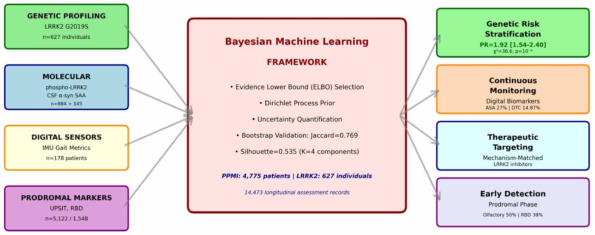
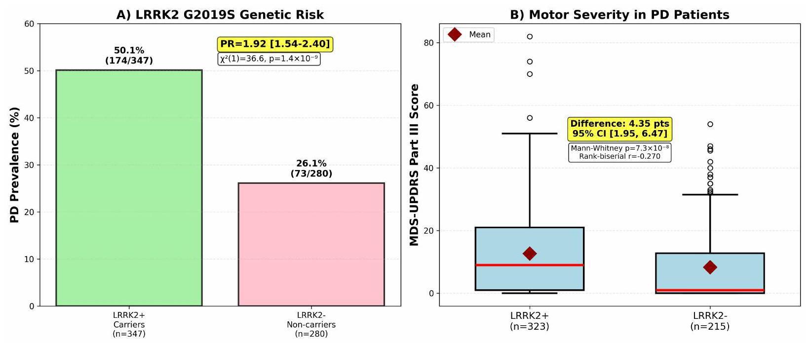
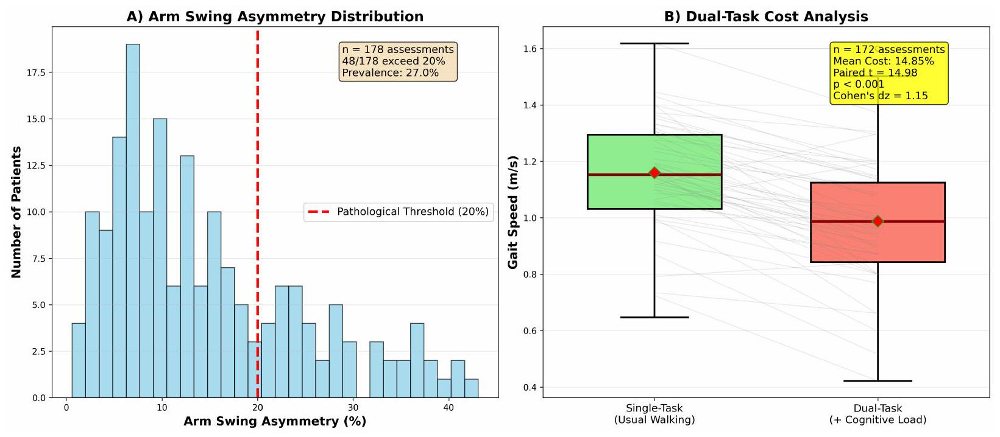
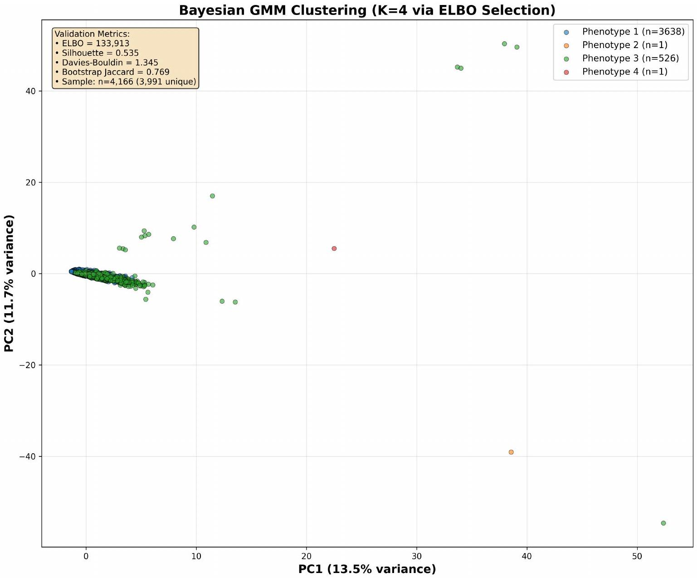
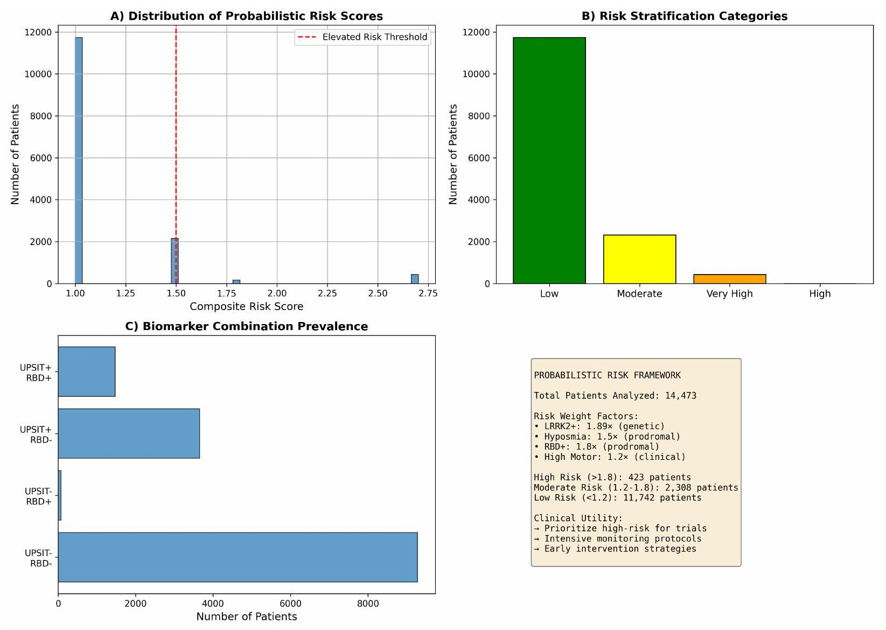

# Integrated Genetic, Molecular, and Wearable Sensor Biomarkers Enable Bayesian Machine Learning-Driven Precision Stratification in Parkinson's Disease

**Harsh Milind Tirhekar, Priyanshi Yadav, Chandrajit Bajaj**

Computational Visualization Center, Oden Institute for Computational Engineering Sciences, The University of Texas at Austin, Austin, TX 78712, USA

**medRxiv preprint** &nbsp; | &nbsp; [Paper](https://doi.org/10.64898/2025.12.02.25340302)

---



**Figure 1.** The project integrates genetic, molecular, wearable, and prodromal biomarker streams through Bayesian clustering and calibrated risk modeling.

---

### TL;DR

This work builds an integrated Parkinson's disease stratification framework across two large cohorts, combining LRRK2 genetics, molecular assays, wearable gait sensing, and prodromal markers with Bayesian machine learning. The result is a mechanism-aware view of heterogeneity that links person-level genetic risk, objective digital motor biomarkers, and uncertainty-aware phenotyping without reducing the story to a single black-box score.

---

### Why this matters

Parkinson's disease is heterogeneous across genetics, motor presentation, and pre-motor symptoms, but many analyses still evaluate these signals in isolation. This paper instead asks whether meaningful patient structure becomes clearer when multiple biomarker modalities are analyzed together and interpreted in the context of mechanism-targeted precision medicine.

The emphasis is on interpretable stratification rather than a turnkey diagnostic tool. That distinction matters because the strongest contribution here is the integrated biomarker framework itself: how genetics, molecular readouts, wearable measures, and prodromal assessments can be combined into a coherent clinical-research view of Parkinson's disease variability.

---

### Framework and Data

The study integrates two complementary cohorts. PPMI contributes 4,775 patients with 14,473 longitudinal records spanning motor, cognitive, olfactory, sleep, autonomic, and wearable assessments. The LRRK2 Cohort Consortium contributes 627 individuals and 2,958 specimens, enabling person-level genetic analysis alongside molecular assays such as urinary phospho-LRRK2 and CSF alpha-synuclein seed amplification.

Within this framework, the paper combines four biomarker streams: LRRK2 G2019S carrier status, molecular assays tied to kinase activity and synuclein pathology, wearable IMU-derived gait markers, and prodromal clinical markers such as UPSIT and RBD screening. Bayesian Gaussian mixture modeling is then used for uncertainty-aware clustering, while a separate penalized logistic model is used for calibrated risk prediction in the tri-modal cognitive subset.



**Figure 2.** Person-level LRRK2 G2019S association results: higher Parkinson's prevalence in carriers and higher baseline motor burden among affected carriers.



**Figure 3.** Wearable IMU-derived gait biomarkers capture both passive asymmetry and active dual-task interference in Parkinson's motor assessment.

---

### Key Findings

- LRRK2 G2019S carriers showed substantially higher Parkinson's prevalence than non-carriers: prevalence ratio 1.92, $\chi^2(1)=36.6$, $p=1.44 \times 10^{-9}$, with sex-adjusted odds ratio 2.73.
- Among patients with Parkinson's disease, carriers also showed higher baseline MDS-UPDRS III burden, with a 4.35-point mean severity difference and 95% CI [1.95, 6.47].
- Wearable IMU analysis identified arm swing asymmetry above threshold in 27% of assessments and a mean dual-task gait-speed degradation of 14.87% ($t=14.98$, $p<0.001$), supporting objective monitoring of cognitive-motor interference.
- The integrated biomarker context includes urinary phospho-LRRK2 measurements in 884 samples and CSF alpha-synuclein seed amplification in 145 samples, positioning molecular assays alongside genetic and digital signals.
- Prodromal screening remained prominent in the broader cohort, with olfactory dysfunction in 50.2% of UPSIT assessments and RBD in 37.5% of screened assessments.
- Bayesian clustering selected $K=4$ via ELBO, with silhouette score 0.535 and bootstrap Jaccard 0.769, indicating structure that was reproducible under resampling.
- The calibrated tri-modal risk model, fit on the $n=204$ subset with simultaneous cognitive, olfactory, and gait measures, achieved AUC 0.717 with calibration slope 1.197.



**Figure 5.** Bayesian Gaussian mixture clustering identifies a stable motor-phenotype structure, with the main signal reflecting mild versus moderate-severe burden plus a small number of outliers.



**Figure 6.** The risk model is presented as a calibrated cognitive-impairment model in the tri-modal subset, not as a general Parkinson's diagnostic classifier.

---

### Clinical Interpretation and Limits

The paper's strongest story is not a universal predictive model, but a multimodal precision-medicine scaffold that connects genetics, molecular pathology, digital monitoring, and prodromal screening. In that framing, LRRK2 results provide a direct genetics-to-clinical link, wearable signals supply scalable objective monitoring, and Bayesian clustering offers interpretable phenotype structure with explicit validation.

Several constraints matter for public-facing interpretation. The overall analysis is primarily cross-sectional, so the page should not imply validated longitudinal progression modeling. The $K=4$ clustering result includes singleton outlier clusters and should not be framed as four equally balanced disease subtypes. Likewise, the AUC 0.717 result applies to cognitive impairment (MoCA < 26) in the $n=204$ tri-modal subset and should not be described as a general Parkinson's diagnosis or prognosis model.

---

### Citation

```bibtex
@article{tirhekar2025integratedpd,
  title   = {Integrated Genetic, Molecular, and Wearable Sensor Biomarkers Enable Bayesian Machine Learning-Driven Precision Stratification in Parkinson's Disease: A Comprehensive Multi-Cohort Validation Study},
  author  = {Tirhekar, Harsh Milind and Yadav, Priyanshi and Bajaj, Chandrajit},
  journal = {medRxiv preprint},
  year    = {2025},
  doi     = {10.64898/2025.12.02.25340302}
}
```
