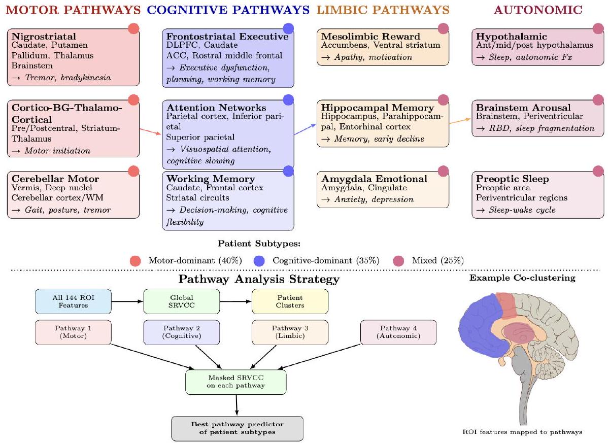
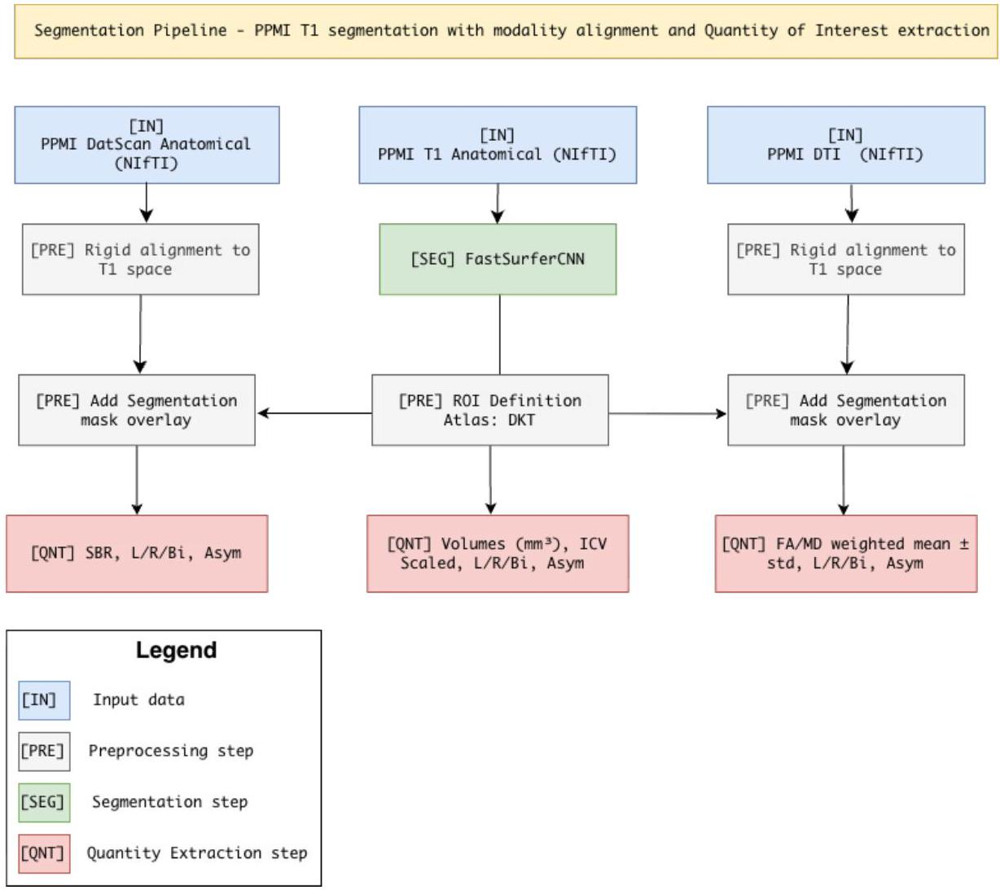
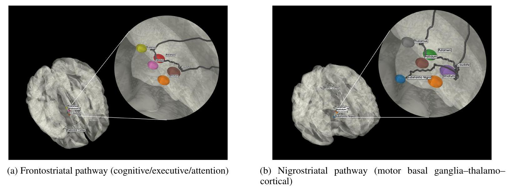
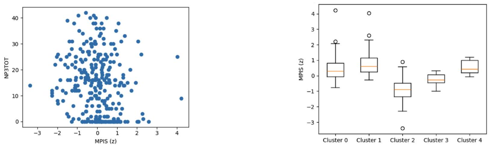
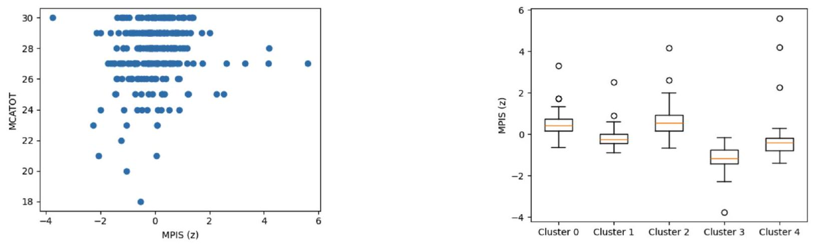

# Pathway-Anchored Multimodal Clustering for Parkinson's Disease

**Ashwin Vinod, Aditya Sai Ellendula, Shubham Bhardwaj, Aparna Dev, Aaron Dominic, Chandrajit Bajaj**

Department of Computer Science, The University of Texas at Austin

Department of Computer Science, Amrita Vishwa Vidyapeetham, Coimbatore, India

**bioRxiv preprint** &nbsp; | &nbsp; [Paper](https://doi.org/10.64898/2025.12.15.694278)

---



**Figure 1.** Pathway-anchored ROI organization and pathway-analysis workflow for Parkinson's disease circuits.

---

### TL;DR

This work organizes multimodal Parkinson's imaging by neurobiological pathway rather than treating the brain as an undifferentiated feature bank. Using structural MRI, diffusion MRI, and DaT-SPECT from the PPMI cohort, the paper combines SRVCC co-clustering with a Multimodal Pathway Integrity Score (MPIS) to recover circuit-level signatures that track motor and cognitive burden while remaining interpretable at the pathway level.

---

### Why this matters

Parkinson's disease is heterogeneous, but many multimodal analyses still produce diffuse latent factors that are hard to interpret biologically. This paper instead asks whether patient structure becomes clearer when imaging features are grouped into known circuits such as nigrostriatal, frontostriatal, limbic, sensory-visuospatial, cerebello-thalamo-cortical, and microvascular pathways.

The resulting representation is intended to support statements like "lower nigrostriatal integrity aligns with greater motor burden" rather than opaque cluster labels with no mechanistic interpretation.

---

### Method

The dataset includes 294 participants from PPMI: 185 with Parkinson's disease, 72 healthy controls, and 37 SWEDD participants. The primary multimodal view combines structural MRI volumetry, free-water-corrected diffusion MRI measures, and DaT-SPECT specific binding ratios.

For each predefined pathway, ROI-level features are standardized and aggregated into a Multimodal Pathway Integrity Score (MPIS). Higher MPIS reflects a more intact pathway signature through higher FA, higher volume and SBR, and lower mean diffusivity.

The subject-by-feature matrix is then analyzed with Scalable Robust Variational Compositional Co-clustering (SRVCC), which jointly learns patient clusters and feature clusters while preserving a pathway-aware interpretation.



**Figure 2.** Structural MRI defines the reference space, diffusion MRI and DaT-SPECT are aligned into it, and regional pathway features are extracted for downstream co-clustering.



**Figure 4.** Motor- and executive-relevant pathways used to anchor multimodal feature construction.

---

### Key findings

- Model selection favored a compact SRVCC configuration of $(K_r, K_c) = (5, 5)$, balancing reconstruction quality and cluster structure.
- Cluster stability was strong across both random seeds and bootstrap resampling: median ARI/NMI of 0.82/0.88 across seeds and 0.76/0.84 across bootstrap runs.
- Nigrostriatal MPIS showed the clearest motor association, with lower integrity linked to higher MDS-UPDRS III burden ($\rho \approx -0.201$, $q \approx 6.8 \times 10^{-4}$).
- Frontostriatal MPIS also tracked motor burden ($\rho \approx -0.191$, $q \approx 0.0014$), supporting the role of executive-attention circuitry in Parkinsonian heterogeneity.
- Sensory/visuospatial MPIS had the strongest cognition association, with higher integrity linked to better MoCA performance ($\rho \approx 0.163$, $q \approx 0.0071$).
- Limbic/mesolimbic MPIS showed a smaller but still positive association with cognition ($\rho \approx 0.119$, $q \approx 0.045$).



**Figure 5.** Nigrostriatal pathway results: lower MPIS aligns with worse motor burden and strong separation across imaging-defined clusters.



**Figure 6.** Sensory/visuospatial pathway results: higher MPIS aligns with better global cognition and strong cluster separation.

---

### Robustness and Interpretation

The paper explicitly frames these effects as coherent but modest pathway-level associations rather than a turnkey diagnostic system. That matters: the value here is not a single headline classifier, but an interpretable multimodal summary that links dopaminergic, microstructural, and morphometric changes back to specific circuits.

The reported pathway patterns were also stable to common MPIS design choices. Across normalization, modality reweighting, and MD sign variants, the primary MPIS remained highly concordant with alternatives, with median Pearson correlation around 0.96 and directionally consistent clinical associations.

---

### Citation

```bibtex
@article{vinod2025pathway,
  title   = {Pathway Anchored Multimodal Clustering Reveals Circuit Level Signatures in Parkinsons Disease},
  author  = {Vinod, Ashwin and Ellendula, Aditya Sai and Bhardwaj, Shubham and Dev, Aparna and Dominic, Aaron and Bajaj, Chandrajit},
  journal = {bioRxiv},
  year    = {2025},
  doi     = {10.64898/2025.12.15.694278}
}
```
