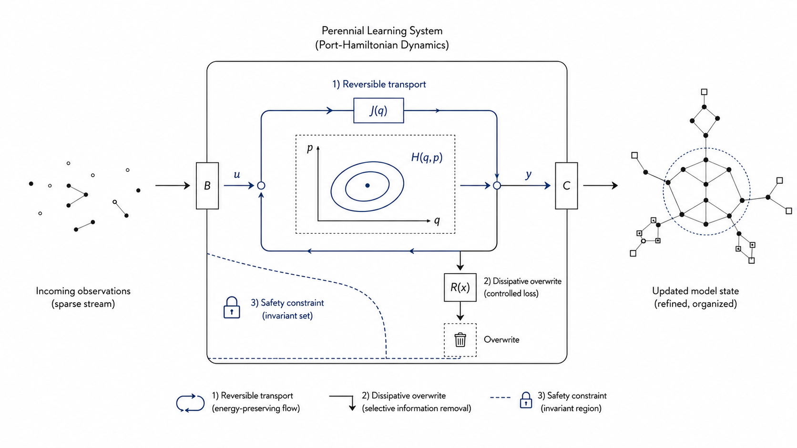
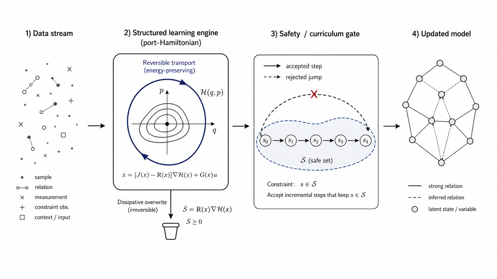
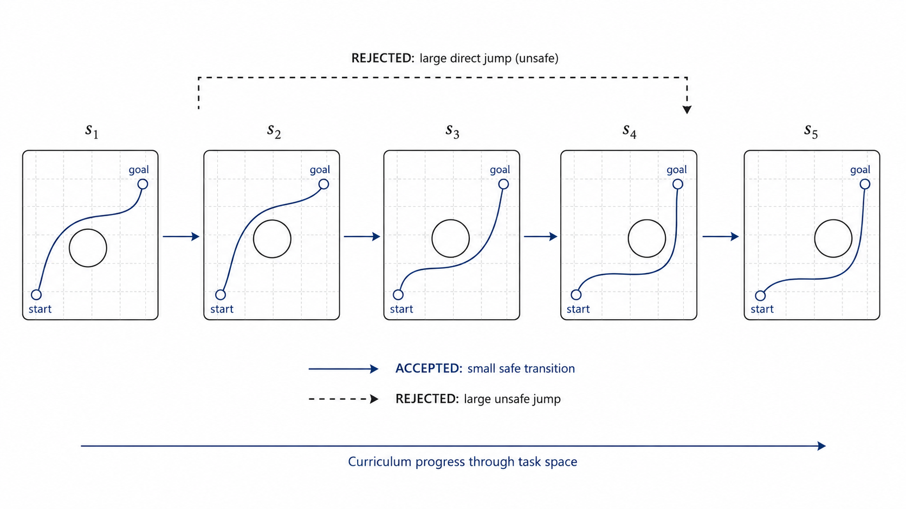
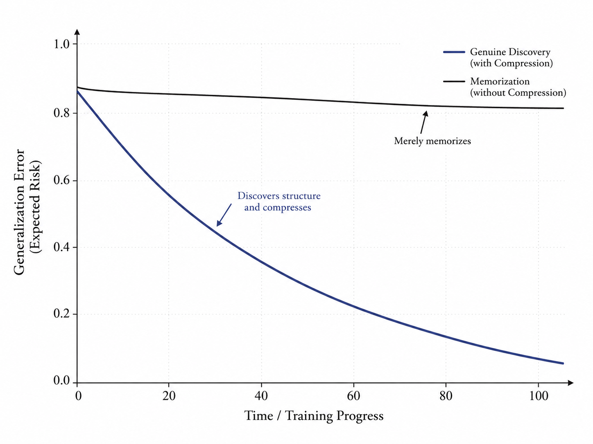
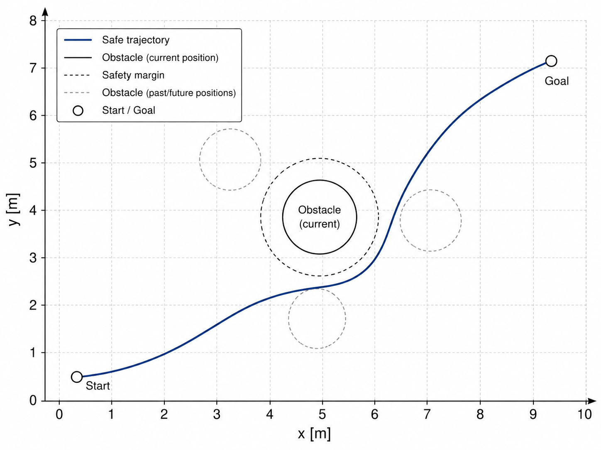

# The Physics, Information, and Computation of Perennial Learning

### Kolmogorov Complexity, Information Distance, and Port-Hamiltonian Thermodynamics

**Chandrajit Bajaj**

_Entropy, 2026. Special Issue dedicated to Professor Paul Vitányi._

[[Paper PDF]](/papers/perennial-learning-kolmogorov-final-april2026.pdf) &nbsp; [[Special Issue Flyer]](/papers/vitanyi-80-special-issue-flyer.pdf)

---



---

## Overview

Real-world learning systems rarely receive a fixed dataset once and stop. They operate under changing environments, safety constraints, limited memory, and finite energy budgets. This paper develops a framework for **perennial learning**: agents that continue to refine their models while explicitly accounting for what must be preserved, what can be reversibly reorganized, and what must be irreversibly overwritten.

The central viewpoint is that learning is not just optimization. It is structured information processing with a cost:

- **Kolmogorov complexity** treats discovery as compression: a better model gives a shorter description of the observed world.
- **Landauer accounting** assigns a minimal thermodynamic cost to irreversible bit erasure in a physical implementation.
- **Port-Hamiltonian dynamics** separates reversible inference from dissipative forgetting through the decomposition $(J - R)\nabla H$.
- **Information distance** gives a geometry for measuring how far one task, model, or environment is from another.

Together, these ideas define a learning engine that can adapt continually without treating forgetting, safety, and curriculum design as afterthoughts.

## Core Idea

The paper interprets each learning episode as a Szilard-style cycle:

1. The learner observes new data.
2. The current belief state is transported toward a better model.
3. Useful structure is preserved.
4. Outdated beliefs are overwritten only through an explicit dissipative channel.
5. The update is accepted only if it respects the available information and safety budget.

The Maxwell's demon analogy is used as a modeling lens, while the formal claims are stated through explicit assumptions, propositions, and computable proxies.



## Perennial Inference Engine

The proposed inference engine keeps the major update channels separate:

| Channel                    | Role                                         | Cost interpretation             |
| -------------------------- | -------------------------------------------- | ------------------------------- |
| Reversible transport       | Reorganizes beliefs without overwriting them | Zero Landauer cost in principle |
| Dissipative overwrite      | Removes outdated beliefs                     | Irreversible erasure budget     |
| Observation port           | Brings new data into the system              | Information intake              |
| Casimir lock               | Protects structural invariants               | No repeated overwrite cost      |
| Barrier and margin shaping | Maintains safety under changing constraints  | Geometry-dependent update cost  |

This separation is the main architectural contribution. Instead of hiding every update inside a generic optimizer, the framework exposes which part of learning is reversible, which part is irreversible, and which structure should never be overwritten.

## Curriculum as Information Geometry

The paper uses Normalized Information Distance (NID) as the ideal task-distance measure and Normalized Compression Distance (NCD) as a computable surrogate. The practical rule is:

```text
Accept the next curriculum step only when its NCD is within the current safe update budget.
```

Large task jumps can force abrupt feasible-set changes, causing safety violations or excessive overwrite. Small, information-aware curriculum steps allow the learner to adapt through an admissible sequence.



## Safety, Identifiability, and Forgetting

The framework connects three normally separate questions:

- **Safety:** Does the trajectory remain inside the feasible set?
- **Identifiability:** Are the observations informative enough to reduce uncertainty?
- **Forgetting:** How much old model structure must be erased to accept the new task?

Port-Hamiltonian passivity gives a speed limit for how quickly constraints can tighten. Fisher information gives a local proxy for posterior codelength contraction. NCD measures whether the next task is close enough to the current one to be absorbed safely.



## Running Example

The numerical example is a moving-obstacle double-integrator problem. The agent must move from a start point to a goal while avoiding a circular obstacle whose position and radius change across curriculum stages.

The experiment compares:

| Method      | Violation % | Min clearance | Mean path length | Measurements |
| ----------- | ----------: | ------------: | ---------------: | -----------: |
| PH+NCD      |        0.00 |         0.043 |            3.771 |           49 |
| Forced jump |        6.20 |        -0.234 |            3.921 |          148 |
| No barrier  |        3.40 |        -0.088 |            4.102 |           90 |
| Cold start  |        0.00 |         0.063 |            4.073 |         1419 |

The NCD-gated curriculum admits an intermediate chain instead of forcing a direct jump. In the toy run, this keeps clearance positive while requiring far fewer measurements than the chosen cold-start baseline.

## Key Contributions

1. A clear separation between ideal Kolmogorov-complexity statements and practical compressor/MDL surrogates.
2. A port-Hamiltonian architecture for perennial learning with separate reversible, dissipative, safety, and invariant-preserving channels.
3. A passivity-based speed limit for safe curriculum-induced feasible-set contraction.
4. A local Fisher/Laplace/MDL proxy for posterior codelength contraction.
5. A sequential information-budget result showing when warm starts reduce the effective per-stage sample requirement.
6. A moving-obstacle case study with NCD-gated scheduling and explicit safety/overwrite diagnostics.



## Limitations

The paper is careful about the scope of its claims:

- True Kolmogorov complexity is uncomputable, so implementations use explicit code proxies such as LZMA/XZ or MDL.
- Compressor calibration is local to the finite serialized model family visited by the curriculum.
- Fisher information is only a local codelength proxy and can fail under multimodality, aliasing, or model misspecification.
- The improvement from cold-start complexity to active-block warm-start complexity is conditional on the warm-start assumptions and the chosen cold-start baseline.
- NCD is a screen for admissibility, not a universal safety guarantee.

## BibTeX

```bibtex
@article{bajaj2026perennial_learning,
  title   = {The Physics, Information, and Computation of Perennial Learning: Kolmogorov Complexity, Information Distance and Port-Hamiltonian Thermodynamics},
  author  = {Bajaj, Chandrajit},
  journal = {Entropy},
  year    = {2026},
  note    = {Special Issue dedicated to Professor Paul Vitanyi}
}
```
