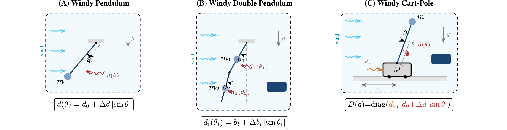
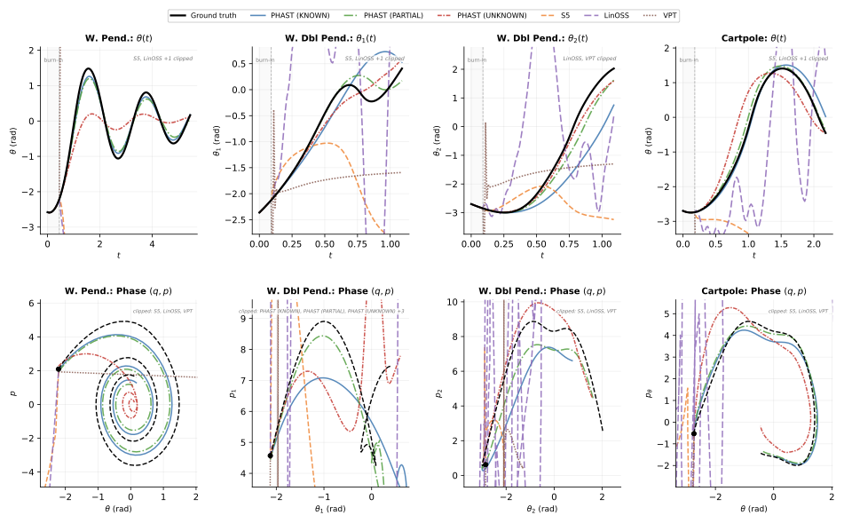
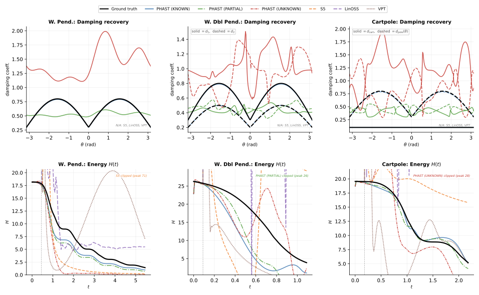

# PHAST: Port-Hamiltonian Architecture for Structured Temporal Dynamics Forecasting

**[Shubham Bhardwaj](https://scholar.google.com/citations?hl=en&user=50Ue3d4AAAAJ)<sup>1,2</sup>, [Chandrajit Bajaj](https://www.cs.utexas.edu/~bajaj/)<sup>1</sup>**

<sup>1</sup>Department of Computer Science & Oden Institute, The University of Texas at Austin
<sup>2</sup>[Mihawk.ai](https://mihawk.ai)

[Paper](https://arxiv.org/pdf/2602.17998) &nbsp; | &nbsp; [arXiv](https://arxiv.org/abs/2602.17998) &nbsp; | &nbsp; [Project Page](https://shubham0704.github.io/phast/)

---


**100-step open-loop rollouts across 8 physical systems.**
Blue = PHAST (Known), Green = PHAST (Partial), Red = GRU, Gold = S5, Purple = LinOSS, White = ground truth. PHAST tracks ground truth where baselines diverge.

---

### TL;DR

We embed the port-Hamiltonian energy structure $\dot{x}=(J{-}R)\nabla H(x)$ into a neural architecture that decomposes dynamics into potential $V(q)$, mass $M(q)$, and damping $D(q)$. Across 13 benchmarks spanning 6 physical domains, this structure alone yields the best long-horizon stability — outperforming S5, GRU, Transformers, and other baselines by up to $10^5\times$.

---

### Abstract

Real physical systems are dissipative — a pendulum slows, a circuit loses charge to heat — and forecasting their dynamics from partial observations is a central challenge in scientific machine learning. We address the _position-only_ ($q$-only) problem: given only generalized positions $q_t$ at discrete times (momenta $p_t$ latent), learn a structured model that (a) produces stable long-horizon forecasts and (b) recovers physically meaningful parameters when sufficient structure is provided.

The port-Hamiltonian framework makes the conservative-dissipative split explicit via $\dot{x} = (J - R)\nabla H(x)$, guaranteeing $dH/dt \le 0$ when $R \succeq 0$. We introduce **PHAST** (Port-Hamiltonian Architecture for Structured Temporal dynamics), which decomposes the Hamiltonian into potential $V(q)$, mass $M(q)$, and damping $D(q)$ across three knowledge regimes (KNOWN, PARTIAL, UNKNOWN), uses efficient low-rank PSD/SPD parameterizations, and advances dynamics with Strang splitting.

Across thirteen $q$-only benchmarks spanning mechanical, electrical, molecular, thermal, gravitational, and ecological systems, PHAST achieves the best long-horizon forecasting among competitive baselines and enables physically meaningful parameter recovery when the regime provides sufficient anchors. We show that identification is fundamentally ill-posed without such anchors (gauge freedom), motivating a two-axis evaluation that separates forecasting stability from identifiability.

---

### Three Knowledge Regimes, One Template

PHAST unifies three levels of prior knowledge under a single port-Hamiltonian template. The architecture is identical across regimes — only the component instantiations change.

**KNOWN** — $V(q)$: given from physics | $M(q)$: given from physics | $D(q)$: _learned_ (PSD) | Identifiable
_E.g., pendulum, RLC circuit, Lennard-Jones, heat exchange_

**PARTIAL** — $V(q)$: template + learned $\tilde{V}$ | $M(q)$: given | $D(q)$: _learned_ (bounded) | Partially identifiable
_E.g., double pendulum, N-body gravity, cart-pole_

**UNKNOWN** — $V(q)$: neural network | $M(q)$: neural SPD net | $D(q)$: neural PSD net | Not identifiable
_E.g., predator-prey, black-box dynamics_

**Shared across all regimes:** port-Hamiltonian state $x=(q,p)$ with conservative-dissipative split | passivity guarantee $dH/dt \le 0$ by construction | Strang-split symplectic integration | causal velocity observer for $q$-only input

---

### Key Insight: Forecasting ≠ Identifiability



These three systems form a progression of structural complexity: **Windy Pendulum** (1-DOF, scalar damping $d(\theta)$), **Double Pendulum** (2-DOF chain with configuration-dependent mass $M(q)$), and **Cart-Pole** (mixed topology $\mathbb{R} \times S^1$, per-DOF damping with two distinct mechanisms: constant cart friction $d_c$ and position-dependent angular wind damping $d(\theta)$).

A model that forecasts well need not recover the true physics — damping $D(q)$ can act as a "stabilizer" absorbing errors in $V$ or $M$, making the inverse problem **non-identifiable** without sufficient structure. PHAST exposes this via two evaluation axes:

- **Forecasting** — rollout MSE at $H{=}100$: PHAST (PARTIAL) achieves the best forecasting across all three systems
- **Identifiability** — damping $R^2_D$ vs. ground truth: PHAST (KNOWN) achieves near-perfect recovery ($R^2_D \approx 1$) on Pendulum and Double Pendulum

Baselines (S5, LinOSS, VPT) do not expose explicit damping fields — they can forecast, but cannot tell you _why_ the system dissipates.


_Rollouts & phase portraits: PHAST tracks ground truth in state and phase space._


_Damping recovery & energy passivity: KNOWN regime recovers true $D(q)$._

---

### Benchmark Systems

Evaluated across 13 benchmarks spanning 6 physical domains. The 8 systems below appear in the animated comparison above.

| System          | DOF   | Regime  | Description                                                        |
| --------------- | ----- | ------- | ------------------------------------------------------------------ |
| Windy Pendulum  | 1-DOF | KNOWN   | Simple pendulum with position-dependent air drag                   |
| Double Pendulum | 2-DOF | PARTIAL | Two-link chain with chaotic dynamics and wind forcing              |
| Cart-Pole       | 2-DOF | KNOWN   | Cart on rail with inverted pendulum, mixed topology                |
| RLC Circuit     | 1-DOF | KNOWN   | Charge = position, flux = momentum, resistance = dissipation       |
| LJ-3 Particles  | 6-DOF | KNOWN   | Three particles via Lennard-Jones potential with Langevin friction |
| Heat Exchange   | 2-DOF | KNOWN   | Two coupled thermal masses with thermal momentum analog            |
| N-body Gravity  | 6-DOF | PARTIAL | Three gravitational bodies in 2D, masses learned from data         |
| Predator-Prey   | 1-DOF | UNKNOWN | Lotka-Volterra with carrying capacity, all components learned      |

---

### Results

Suite summary across thirteen $q$-only benchmarks. Best PHAST regime vs. best baseline (mean $\pm$ std over 5 seeds).

**Mechanical systems** (rollout MSE at $H=100$)

| Benchmark                      | Best PHAST                        | Best Baseline                   | Gain                   |
| ------------------------------ | --------------------------------- | ------------------------------- | ---------------------- |
| Pendulum (conservative)        | **0.680 $\pm$ 0.043** (PARTIAL)   | 2.320 $\pm$ 0.224 (Transformer) | **3.4x**               |
| Pendulum (damped)              | **0.017 $\pm$ 0.005** (KNOWN)     | 0.450 $\pm$ 0.241 (D-LinOSS)    | **26.5x**              |
| Pendulum (windy)               | **0.092 $\pm$ 0.014** (PARTIAL)   | 0.435 $\pm$ 0.239 (D-LinOSS)    | **4.7x**               |
| Cart-Pole (windy)              | **0.063 $\pm$ 0.019** (KNOWN)     | 0.431 $\pm$ 0.077 (S5)          | **6.8x**               |
| Oscillator (conservative)      | **0.0010 $\pm$ 0.0002** (KNOWN)   | 1.087 $\pm$ 0.299 (Transformer) | **1.1x10<sup>3</sup>** |
| Oscillator (damped)            | **0.0011 $\pm$ 0.0003** (PARTIAL) | 0.926 $\pm$ 0.254 (Transformer) | **8.4x10<sup>2</sup>** |
| Double pendulum (conservative) | **0.402 $\pm$ 0.047** (PARTIAL)   | 0.618 $\pm$ 0.028 (S5)          | **1.5x**               |
| Double pendulum (damped)       | **0.320 $\pm$ 0.032** (PARTIAL)   | 0.630 $\pm$ 0.031 (S5)          | **2.0x**               |

**Non-mechanical systems** (next-step MSE)

| Benchmark      | Best PHAST                          | Best Baseline                      | Gain                   |
| -------------- | ----------------------------------- | ---------------------------------- | ---------------------- |
| RLC circuit    | **2.63x10<sup>-5</sup>** (UNKNOWN)  | 4.81x10<sup>-4</sup> (Transformer) | **18x**                |
| LJ-3 cluster   | **4.59x10<sup>-10</sup>** (PARTIAL) | 2.05x10<sup>-4</sup> (S5)          | **4.5x10<sup>5</sup>** |
| Heat exchange  | **2.42x10<sup>-6</sup>** (KNOWN)    | 4.46x10<sup>-4</sup> (LinOSS)      | **1.8x10<sup>2</sup>** |
| N-body gravity | **4.27x10<sup>-8</sup>** (PARTIAL)  | 1.83x10<sup>-3</sup> (Transformer) | **4.3x10<sup>4</sup>** |
| Predator-prey  | **0.0199** (UNKNOWN)                | 0.179 (Transformer)                | **9.0x**               |

---

### BibTeX

```bibtex
@article{bhardwaj2026phast,
  title   = {PHAST: Port-Hamiltonian Architecture for Structured Temporal Dynamics Forecasting},
  author  = {Bhardwaj, Shubham and Bajaj, Chandrajit},
  journal = {arXiv preprint arXiv:2602.17998},
  year    = {2026},
  url     = {https://arxiv.org/abs/2602.17998}
}
```

---

### People

- [Shubham Bhardwaj](https://scholar.google.com/citations?hl=en&user=50Ue3d4AAAAJ)
- [Chandrajit Bajaj](https://www.cs.utexas.edu/~bajaj/)
