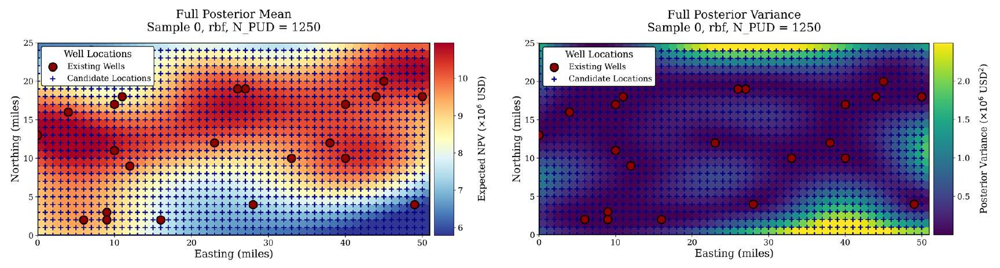
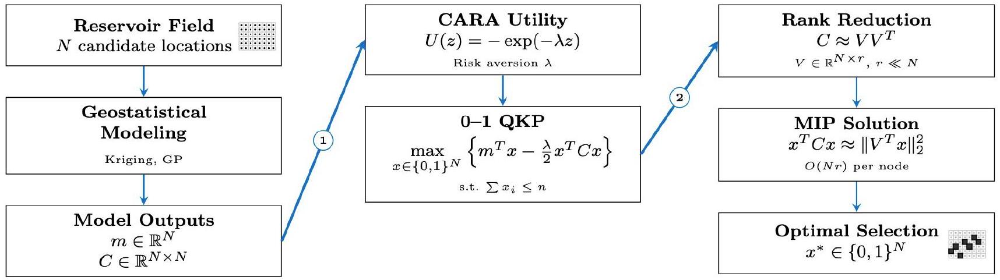
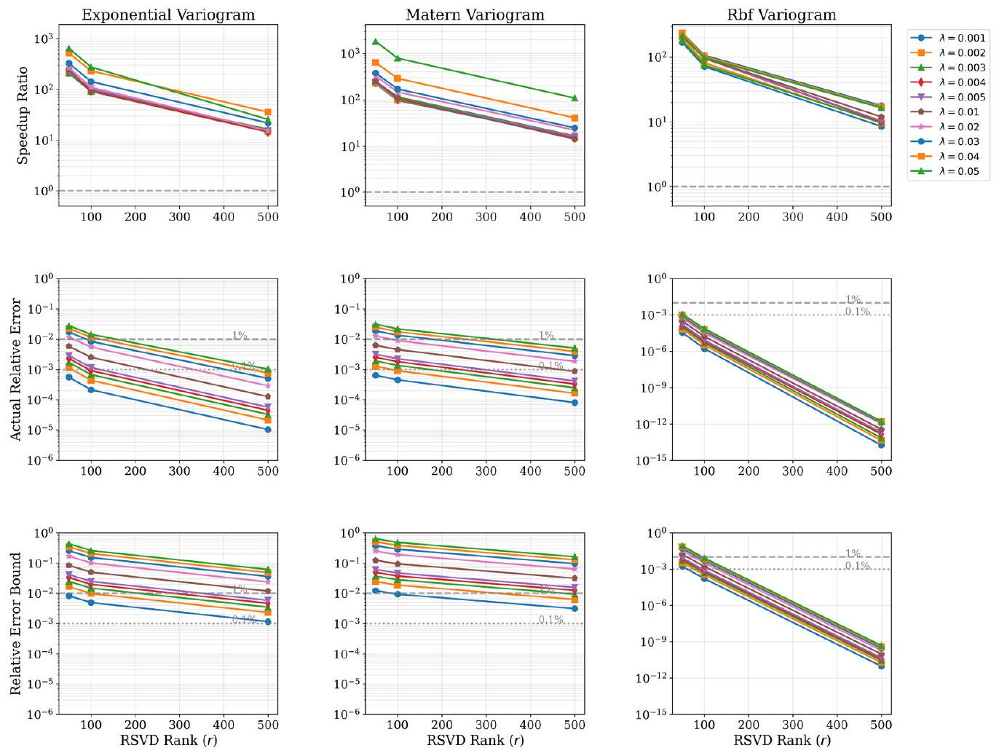
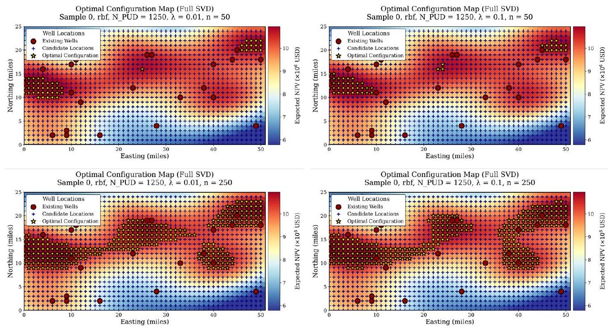

# Scalable Risk-Averse Well-Placement Optimization Using Quadratic Knapsack + Randomized SVD

**R. Farell, J. E. Bickel, C. Bajaj**

Operations Research & Industrial Engineering, Oden Institute, and Department of Computer Science, The University of Texas at Austin

**SPE Journal (2026)** &nbsp; | &nbsp; [Paper (SPE 231170-PA)](https://doi.org/10.2118/231170-PA) &nbsp; | &nbsp; [Code](https://github.com/rfarell/well-placement-qkp)

---

## TL;DR

This work frames risk-averse shale well selection as a binary quadratic knapsack problem (QKP) under a CARA utility model, then accelerates it with randomized SVD (RSVD). On synthetic field-scale cases, low-rank RSVD surrogates deliver **10x to 1,851x speedups** while keeping certainty-equivalent (CE) error in the **0.1% to 1%** range, with **<=0.3% CE error at rank `r=100`** across tested kernels.

---

## Motivation

Operators must choose a small number of wells from thousands of candidates under strong spatial correlation and uncertainty in NPV. Naive expected-value optimization ignores risk concentration, while exact risk-aware quadratic optimization becomes expensive when covariance matrices are large.



**Figure 3.** GP posterior maps used to construct candidate-level expected NPV and uncertainty.

---

## Method

1. Build geostatistical mean vector `m` and covariance `C` over candidate wells.
2. Optimize CARA-normal CE objective as a `0-1` QKP: maximize `m^T x - (lambda/2) x^T C x` with a cardinality cap.
3. Replace dense `C` with RSVD low-rank surrogate `C ~= V V^T` to reduce per-node evaluation from `O(N^2)` to `O(Nr)`.
4. Use error bounds to connect CE approximation quality to spectral tail decay and risk parameter `lambda`.



**Figure 1.** Three-stage workflow: geostatistical inputs, QKP formulation, and RSVD acceleration.

---

## Results

- Across tested synthetic scenarios (`N <= 5,000`), RSVD-QKP reports **10x-1,851x** speedups.
- For practical ranks (`r >= 50`), CE gaps stay **below 1%** across tested kernels and risk levels.
- At `r=100`, CE gaps are **<=0.3%** across tested kernels.
- In a challenging Matern case, `r=100` is about **90x faster** than dense QKP with around **0.05% CE gap**.



**Figure 2.** Speedup and CE-error summary across Matern, Exponential, and RBF kernels.



**Figure 5.** Optimal well-set diversification as risk aversion `lambda` and portfolio size `n` vary.

---

## Impact

The method gives asset teams a practical screening tool that preserves risk-awareness, adds optimization certificates (unlike heuristic-only search), and scales to field-sized candidate sets without materially degrading decision quality.

---

## Citation

```bibtex
@article{farell2026scalable,
  title   = {Scalable Risk-Averse Well-Placement Optimization Using Quadratic Knapsack Problem and Randomized Singular Value Decomposition},
  author  = {Farell, R. and Bickel, J. E. and Bajaj, C.},
  journal = {SPE Journal},
  volume  = {31},
  number  = {01},
  pages   = {480--496},
  year    = {2026},
  publisher = {OnePetro}
}
```
