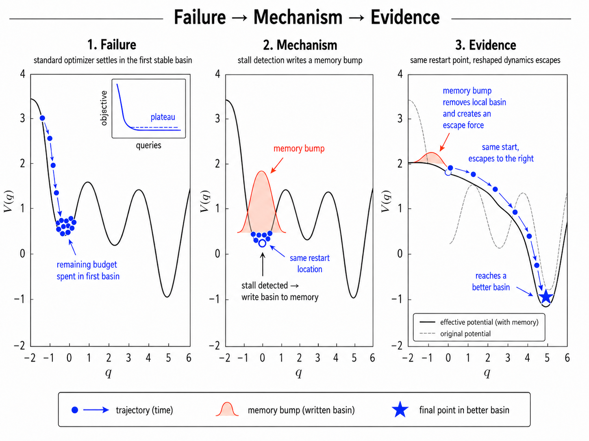
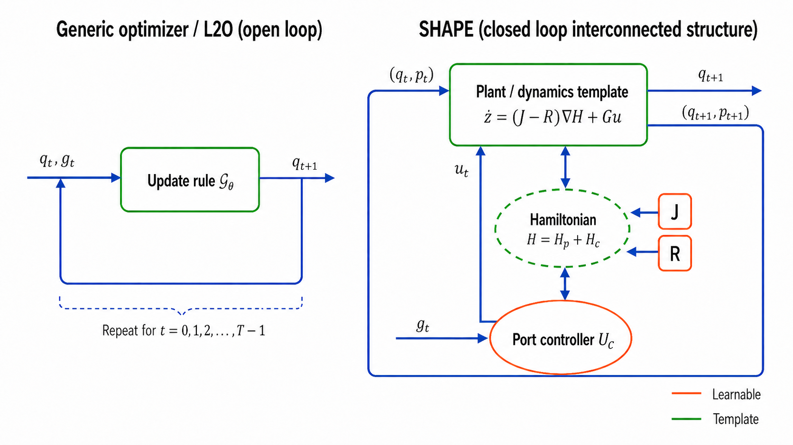
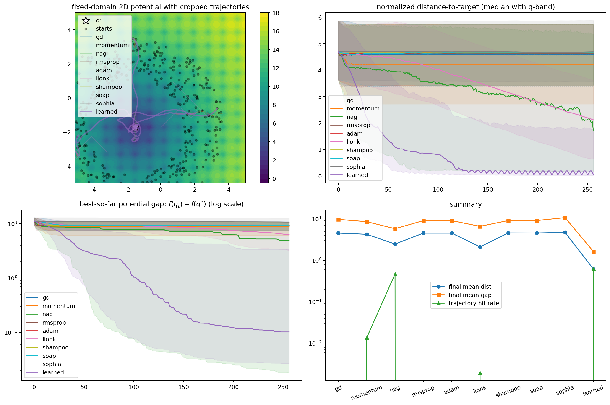
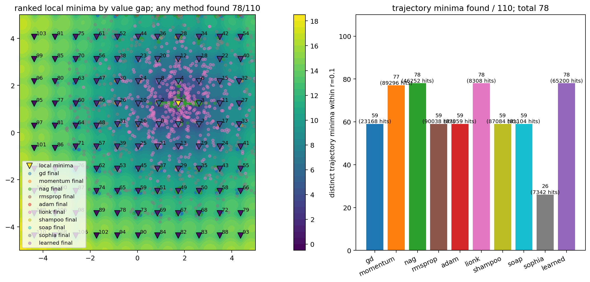

# SHAPE: Event-Triggered Hamiltonian Learning to Optimize

**[Yi Wang](mailto:panzer.wy@utexas.edu)<sup>1</sup>, [Chandrajit Bajaj](https://www.cs.utexas.edu/~bajaj/)<sup>1,2</sup>**

<sup>1</sup>Oden Institute, The University of Texas at Austin  
<sup>2</sup>Department of Computer Science, The University of Texas at Austin

[arXiv](https://arxiv.org/abs/2605.06868) &nbsp; | &nbsp; [Code](TODO) &nbsp; | &nbsp; [Project Page](TODO)

---



**Fixed-budget optimization as basin navigation.** A standard local optimizer can descend into the first stable basin and spend the remaining budget there. SHAPE records stagnation events, reshapes the local energy landscape with memory, and redirects the next stage toward unexplored basins.

---

### TL;DR

Fixed-budget nonconvex optimization can fail because descent is _too stable_: once a local optimizer settles in an uninformative basin, it may keep refining that basin instead of searching elsewhere. **SHAPE** treats stagnation as a control event. It lifts optimization from $q$ to phase space $(q,p)$, uses a port-Hamiltonian controller to regulate descent, damping, and energy shaping, and updates memory across stages to avoid repeatedly exploiting the same local minimum.

---

### Abstract

We study fixed-budget minimization of an objective $f(q)$ observed through a local oracle. Classical gradient methods and many learned optimizers produce stable local descent, but this stability can become a failure mode in rugged nonconvex landscapes: after reaching a nearby stationary point, the optimizer may spend the remaining evaluations refining a basin that is irrelevant to the best solution available under the same budget.

We introduce **SHAPE**, a structured adaptive port-Hamiltonian optimizer for event-triggered minima hunting. Starting from gradient-descent dynamics, SHAPE lifts the optimizer state to $x=(q,p)$, where $q$ is the candidate solution and $p$ is a cotangent sensitivity variable. Within each stage, a shaped Hamiltonian induces structured local descent; across stages, an event interface updates memory, anchors, modes, and budget allocation when stagnation or local equilibrium is detected. The implemented system uses a fixed slow event clock, while the analysis allows stage-dependent horizons as a direct generalization.

The method preserves a passivity-compatible plant--controller structure while allowing the same trained policy to process clean gradients, stochastic gradients, or zeroth-order gradient estimates. Experiments on fixed-budget nonconvex optimization tasks show that SHAPE improves best-so-far performance and local-minima discovery compared with fixed-policy optimizers under matched budgets, while also exposing limitations on high-dimensional separable landscapes.

---

### Key Insight: Stable Descent Is Not Enough



Many optimizers can be viewed as dynamical systems, but most deployment-time update laws remain fixed: they map local oracle information directly to the next iterate. SHAPE instead represents optimization as a closed-loop port-Hamiltonian interconnection.

At stage $s$, the optimizer uses a shaped Hamiltonian

$$
H_s(q,p)=f(q)+U_s^{\rm shp}(q;m_s)+\frac12p^\top M_s^{-1}p,
$$

where $m_s$ is memory, $U_s^{\rm shp}$ encodes basin-level shaping, and $M_s$ defines the kinetic metric. The stage dynamics have the port-Hamiltonian form

$$
\dot{x}=\bigl(J_s(x)-R_s(x)\bigr)\nabla H_s(x)+G_s(x)u_s,
$$

where $J_s=-J_s^\top$ organizes conservative transport, $R_s\succeq 0$ injects dissipation, and $u_s$ is a bounded port input. This separates three roles that are conflated in a generic learned update: local stabilization, active energy shaping, and memory-driven basin escape.

---

### One Template, Three Oracle Regimes

SHAPE uses the same structured state representation and controller template while varying the oracle input available at test time.

**Clean first-order oracle** — $g(q)=\nabla f(q)$  
Used when differentiable objectives are available. The controller receives exact local force information and learns when to dissipate, exploit, or reshape the Hamiltonian.

**Stochastic first-order oracle** — $g(q)=\nabla f(q)+\xi$ or mini-batch gradient  
Used when gradients are noisy or estimated from sampled data. The port controller can regulate the effect of noisy forces through damping and bounded actuation.

**Zeroth-order estimated oracle** — $g(q)$ estimated from function-value probes  
Used when only black-box evaluations are available. The same trained SHAPE checkpoint can be evaluated with a finite-difference or random-direction force estimate, although oracle quality becomes a limiting factor.

**Shared across all regimes:** phase-space state $(q,p)$ | stagewise shaped Hamiltonian | memory of visited basins | port input $u^{\rm port}=u^{\rm shp}-K^d y$ | event-triggered stage updates | matched fixed-budget evaluation.

---

### Benchmark Tasks

The experiments target minima hunting rather than only terminal convergence. Metrics therefore separate final-state performance from best-so-far performance.

| Task family | Oracle | Dimensions | Why it matters |
| ----------- | ------ | ---------- | -------------- |
| Multi-well 1D | noisy first-order | $1$ | Illustrates first-basin trapping and memory-driven escape |
| Ackley | exact first-order | $2,20,100,500$ | Rugged landscape with many local basins |
| Lévy | exact first-order | $2,20,100,500$ | Nonconvex landscape with structured basin geometry |
| Rastrigin | exact first-order | $2,20,100,500$ | High-dimensional separable stress test |
| Lennard--Jones | autodiff first-order | $6,18$ | Scientific energy landscape with many local minima |
| Phase retrieval | full/mini-batch first-order | $8,32$ | Inverse problem with nonconvex observation geometry |
| Control trajectory optimization | adjoint/autodiff first-order | $8,32$ | Dynamical optimization with best-so-far vs. terminal tradeoff |

---

### Results

Dimension-averaged results show that SHAPE is strongest when the evaluation criterion rewards fixed-budget exploration and best-seen minima discovery.

| Family | Best SHAPE result | Strong baseline | Main takeaway |
| ------ | ----------------- | --------------- | ------------- |
| Multi-well | best gap **0.477**, hit rate **0.602** | Momentum best gap 1.115, hit rate 0.300 | Memory reshaping improves basin escape |
| Ackley | best gap **0.323**, hit rate **0.486** | NAG best gap 1.31, hit rate 0.389 | SHAPE improves best-so-far search under matched budget |
| Lévy | best gap **0.0427** | RMSProp best gap 0.202 | Better best-seen minima, but RMSProp has stronger hit/AUC metrics |
| Rastrigin | best gap 613 | RMSProp best gap **6.81** | High-dimensional separable landscapes remain a limitation |
| Lennard--Jones | best gap **0.113**, hit rate **0.190** | RMSProp best gap 0.519, hit rate 0.000 | Structured navigation helps rugged scientific energies |
| Phase retrieval | best gap **0.00351**, hit rate **0.631** | NAG best gap 0.040, hit rate 0.000 | SHAPE improves nonconvex inverse-problem minima hunting |
| Control trajopt | best-so-far gap **0.106** | RMSProp terminal gap **1.33** | SHAPE finds good regions, but terminal stabilization is not always best |


_SHAPE improves best-so-far behavior and local-minima discovery on the Ackley first-order benchmark._


_Local-minima discovery comparison: the learned closed-loop policy explores more basins under the fixed budget._

---

### BibTeX

```bibtex
@article{wang2026SHAPE,
      title={When Descent Is Too Stable: Event-Triggered Hamiltonian Learning to Optimize}, 
      author={Yi Wang and Chandrajit Bajaj},
      year={2026},
      eprint={2605.06868},
      archivePrefix={arXiv},
      primaryClass={cs.LG},
      url={https://arxiv.org/abs/2605.06868}, 
}
```

---

### People

- [Yi Wang](https://reimilia.github.io/)
- [Chandrajit Bajaj](https://www.cs.utexas.edu/~bajaj/)
